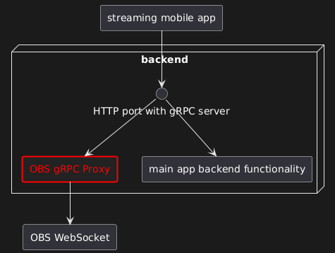

# About
In [`cmd/obsgrpcproxy`](./cmd/obsgrpcproxy/) a [gRPC](https://grpc.io/) proxy for [OBS WebSocket server](https://obsproject.com/kb/remote-control-guide) is provided.



# Motivation

I was experimenting with making a mobile application for IRL streaming. The app communicates with the backend server via gRPC. But at the same time the app needs full access to controlling OBS. So I made this separate proxy to OBS which I can attach to the same gRPC port as the rest of the backend functionality.

# Quick start

One terminal:
```sh
go install github.com/xaionaro-go/obs-grpc-proxy/cmd/obsgrpcproxy@latest
"$(go env GOPATH | awk -F : '{print $1}')"/bin/obsgrpcproxy --obs-password <password from WebSocket Server Settings in OBS>
```

Another terminal (to test if the proxy works):
```sh
go install github.com/xaionaro-go/obs-grpc-proxy/cmd/obsgrpccli@latest
"$(go env GOPATH | awk -F : '{print $1}')"/bin/obsgrpccli --method-name GetStats --request-data '{}'
```

An example (of testing if the proxy works):
```
xaionaro@void:~/go/src/github.com/xaionaro-go/obs-grpc-proxy$ go run ./cmd/obsgrpccli/ --method-name GetStats --request-data '{}'
{
 "memoryUsage": 695,
 "availableDiskSpace": 296551,
 "activeFps": 30,
 "averageFrameRenderTime": 1,
 "renderSkippedFrames": 280,
 "renderTotalFrames": 10508211,
 "webSocketSessionIncomingMessages": 2,
 "webSocketSessionOutgoingMessages": 2
}
```
